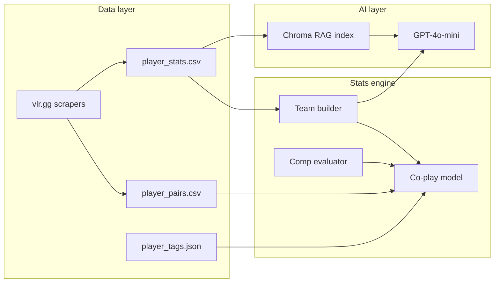

**A Valorant esports analyst that builds lineups, scores team comps, and explains the picks — powered by live vlr.gg stats and a co-play chemistry model.**

Ask it to draft a superteam, rate PRX's roster, find who plays best with f0rsakeN, or chat about the VCT meta. Artemis combines a deterministic stats engine with RAG over scraped pro data and GPT-4o-mini for natural-language answers.

---

## What it does

- **Team builder** — Picks a role-balanced 5-man from the current VCT/GC pool by Rating, ACS, K/D, and agent fit. Modes: balanced, superteam, troll, and co-play chemistry.
- **Roster evaluation** — Scores any org's active roster 0–100 across role balance, stat ceiling, agent coverage, flexibility, and chemistry.
- **Co-play chemistry** — Soft nudges toward shared map history, aligned comms, and IGL structure — without forcing full org stacks. [How it works →](docs/COPLAY.md)
- **Partner finder** — *"Who would play best with X?"* ranked from real pair data, not vibes.
- **Player fit map** — PCA layout of your lineup vs. the VCT pool, with labeled axes and co-play links.
- **RAG chat** — Ask about players, regions, and agents with retrieval-grounded answers and guardrails for off-topic or missing players.

---

## Try it

```bash
python3 -m venv .venv && source .venv/bin/activate
pip install -r requirements.txt
cp .env.example .env   # add OPENAI_API_KEY
python scripts/refresh_data.py   # scrape + index (needs network; skip if chroma_db/ already built)
python server/app.py
```

Open **http://localhost:8000**

Example prompts:

| Prompt | What happens |
|--------|--------------|
| *Build the most stacked VCT superteam* | Global all-star lineup + comp score + player fit map |
| *Rate the current PRX roster* | Org eval with player cards and 0–100 breakdown |
| *Who would play best with f0rsakeN?* | Ranked co-play fits from pair data |
| *Build a Game Changers team with 2 duelists* | Role-constrained GC pool build |
| *Who's the best initiator in VCT Americas?* | RAG over indexed player stats |

Toggle **Co-play chemistry** in Builder settings to see how shared maps and comms nudge the lineup.

---

## How it works



1. **Scrape** — Player stats and match lineups from [vlr.gg](https://www.vlr.gg/stats).
2. **Index** — Stats embedded into a local Chroma vector store for RAG.
3. **Route** — Queries go to team builder, roster eval, partner ranking, or RAG chat depending on intent.
4. **Explain** — GPT-4o-mini narrates lineups; numbers come from the engine, not the model.

Deep dive on the co-play algorithm, swap search, and player fit map: **[docs/COPLAY.md](docs/COPLAY.md)**

---

## Builder settings

| Setting | Options |
|---------|---------|
| **Build style** | Stats-only · Co-play chemistry |
| **Mode** | Auto · Balanced · Superteam · Troll |
| **League** | Auto · VCT · Americas · EMEA · Pacific · Game Changers |

Chemistry mode starts from the stats-optimal lineup and allows at most one swap if co-play improves enough without sacrificing rating.

---

## API

**Health:** `GET /health`

**Chat:** `POST /chat`

```json
{
  "prompt": "Build me a VCT Pacific superteam",
  "chatHistory": "[]",
  "settings": {
    "buildStyle": "chemistry",
    "teamMode": "goated",
    "league": "pacific"
  }
}
```

Team responses include `team` (player cards), `evaluation` (0–100 breakdown), and `chemistryPlot` (player fit map data).

CLI: `python -m artemis.api cli`

---

## Stack

| Layer | Tech |
|-------|------|
| Stats & chemistry | Python, scikit-learn (PCA/KMeans map) |
| Vector search | Chroma + LlamaIndex |
| LLM | GPT-4o-mini |
| Embeddings | text-embedding-3-small |
| UI | Vanilla HTML/JS + Canvas |
| Server | Flask |

---

## Project layout

```
artemis/          Core app — routing, team builder, chemistry, guardrails
scrapers/         vlr.gg stats + co-play pair scrapers
scripts/          refresh_data.py — one-command data pipeline
player-data/      Stats CSV, pair matrix, language/IGL tags
static/           Chat UI
server/app.py     Entry point
docs/COPLAY.md    Co-play algorithm deep dive
```

Generated locally (gitignored): `chroma_db/`, `player-data/photo_cache/`

---

## Data refresh

```bash
python scripts/refresh_data.py
```

Or manually:

```bash
python scrapers/scrape_stats.py
python scrapers/scrape_chemistry.py 6
python -m artemis.build_index
```

Requires network access and a valid `OPENAI_API_KEY` for indexing.
