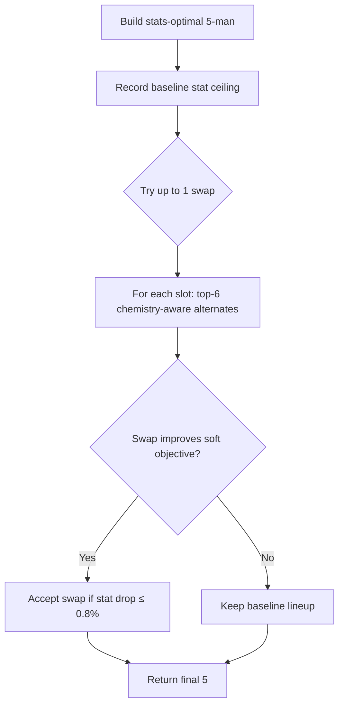

# Co-play & Chemistry

How Artemis models player fit beyond raw stats — shared match history, comms alignment, and IGL structure — without defaulting to "pick the whole org."

---

## Design goals

Most team builders optimize individual Rating. Artemis adds a **soft co-play layer** that nudges lineups toward players who mesh well — using shared map history when available, plus comms language and IGL structure as predictive signals — while still allowing cross-org all-star stacks.

Co-play is **not** "find five players from one team." A chemistry-optimal superteam can (and often does) mix regions and orgs. The algorithm starts from the stats-optimal lineup and only accepts small, chemistry-motivated swaps.

---

## Data sources

| Source | File | What it captures |
|--------|------|------------------|
| Match lineups | `player-data/player_pairs.csv` | Maps played together per player pair (scraped from vlr.gg event pages) |
| Manual tags | `player-data/player_tags.json` | Primary language, IGL flag (curated) |
| Player stats | `player-data/player_stats.csv` | Rating, ACS, agents, role inference |

Pairs are keyed by vlr.gg player ID and aggregated across recent VCT events.

---

## Pair synergy (shared maps)

For two players who share match history, synergy is derived from maps played together with **logarithmic saturation** — early shared reps matter most, with diminishing returns after ~15 maps:

```
synergy(a, b) = min(1.0, log(1 + maps) / log(1 + 15))
```

This avoids over-weighting pairs who've played 40 maps together vs. 20, while still rewarding real co-play.

For **display scoring** (roster chemistry badge), a same-org proxy (0.2) fills in when map data is missing — so org rosters aren't scored as zero-chemistry when the pair scraper is sparse. **Lineup search** uses raw map synergy only, so cross-org picks aren't artificially boosted.

---

## Roster soft chemistry

The lineup objective blends three signals into a 0–1 score:

```
soft_chemistry = 0.50 × map_synergy
               + 0.35 × language_cohesion
               + 0.15 × igl_balance
```

### Map synergy
Average pairwise shared-map synergy across the 5-man. If **3+ players share the same org**, map synergy is dampened by 55% — this prevents chemistry mode from collapsing into org stacks when teammates happen to share a jersey.

### Language cohesion
From `player_tags.json`. Measures how aligned primary comms languages are (1.0 = everyone tagged speaks the same language). Untagged players contribute a neutral default.

### IGL balance
Prefers exactly **one** tagged IGL:
- 0 IGLs → 0.65 (acceptable but not ideal)
- 1 IGL → 1.0
- 2 IGLs → 0.45
- 3+ → 0.2

---

## Pick bonus (during role selection)

While filling each role slot, candidates get a small additive bonus on top of their stat score:

```
pick_bonus = map_bonus + language_nudge + igl_nudge
```

| Signal | Effect |
|--------|--------|
| Shared maps with already-selected players | Up to +0.12 scaled by pair synergy |
| Language matches someone on the roster | +0.045 |
| Language mismatch | −0.018 |
| First IGL on roster | +0.03 |
| Extra IGL when one already selected | −0.05 per duplicate |

These nudges are tiny relative to stat scores (~0.8–1.3), so stats stay primary.

---

## Chemistry lineup search

When **Co-play chemistry** is enabled in Builder settings:



Constraints:
- **Max 1 swap** from the stats-optimal baseline
- **Max stat drop 0.8%** vs. baseline average — no throwing for vibes
- Swap must improve `stat_score + 0.16 × soft_chemistry` and increase soft chemistry by at least 0.015

This is deliberately conservative. Chemistry mode should feel like a smart tiebreaker, not a different sport.

Implementation: `artemis/team/builder.py` → `_build_chemistry_lineup()`

---

## Comp evaluation (0–100)

Every lineup gets a multi-dimensional score from `artemis/team/evaluator.py`:

| Dimension | What it measures |
|-----------|------------------|
| Role balance | 1D / 1I / 1C / 1S + flex |
| Stat ceiling | Per-role composite performance |
| Agent coverage | Info, smokes, anchor present |
| Diversity | Overlapping duelist agent pools |
| Flexibility | Off-role depth on flex slot |
| Chemistry | Co-play score from `chemistry/scoring.py` |

Weights shift when chemistry mode is on — chemistry goes from 10% → **30%** of the overall score; stat ceiling drops slightly. Highlights surface the best and worst dimensions in plain language.

---

## Partner ranking

For queries like *"Who would play best with f0rsakeN?"*, Artemis ranks the full player pool by:

```
fit_score = pair_strength + 0.08 if same org
```

Where `pair_strength` combines shared-map synergy, language match, and org fallback — same logic as the player fit map edges. Results are returned as a ranked text list (no LLM hallucination on pair data).

Handle matching is fuzzy: `f0rsakeN`, `FORSAKEN`, and `forsaken` all resolve to the same player.

---

## Player fit map

After team builds and roster evals, the UI renders a **PCA player map** (`artemis/chemistry/viz.py`):

- **Large colored dots** = your lineup; **small gray dots** = other VCT pros (grouped by similar stat profiles via KMeans)
- **Labeled axes** — derived from the strongest stat/comms signals on each axis (e.g. *Rating & ACS*, *Comms language & IGL*), not jargon like "PC1"
- **Lines** connect your five picks — thickness/color = shared maps, comms, or no link
- Plain subtitle explaining what you're looking at; optional note on how much of player variation the map covers

**Line styles between your picks:**

| Style | Meaning |
|-------|---------|
| Solid red | Shared map history (thicker = more maps) |
| Teal | Aligned comms language |
| Dotted gray | Same org, no map data |
| Dashed | No known link |

Drag to pan, scroll to zoom. The map is for **context and co-play links** — lineup decisions still come from the rule-based chemistry model, not from cluster membership.

---

## Extending the model

**Add language / IGL tags** — edit `player-data/player_tags.json`:

```json
{
  "12345": { "language": "en", "igl": true }
}
```

**Refresh co-play data:**

```bash
python scrapers/scrape_chemistry.py 6   # last 6 VCT events
python scripts/refresh_data.py          # full pipeline
```

Pair coverage varies by region — Americas/EMEA tend to be denser than Pacific in the current scrape window.

---

## Code map

| Module | Responsibility |
|--------|----------------|
| `artemis/chemistry/scoring.py` | Pair synergy, pick bonuses, roster chemistry, partner ranking |
| `artemis/chemistry/viz.py` | PCA + KMeans player fit map |
| `artemis/team/builder.py` | Role-based selection, chemistry swap search |
| `artemis/team/evaluator.py` | 0–100 comp scoring with chemistry weighting |
| `scrapers/scrape_chemistry.py` | Builds `player_pairs.csv` from vlr.gg match pages |
